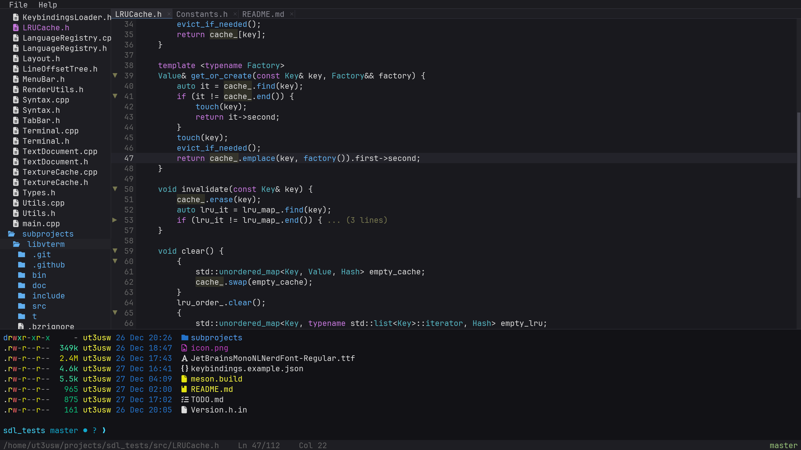

# DeadEditor

A fast, lightweight code editor built with SDL2.




## Requirements

### Linux

```bash
# Ubuntu/Debian
sudo apt install libsdl2-2.0-0 libsdl2-ttf-2.0-0 libtree-sitter0

# Fedora
sudo dnf install SDL2 SDL2_ttf libtree-sitter

# Arch
sudo pacman -S sdl2 sdl2_ttf tree-sitter
```

### Optional

```bash
# All platforms - install ripgrep for global search (Ctrl+Shift+F)
# Ubuntu/Debian
sudo apt install ripgrep

# Fedora
sudo dnf install ripgrep

# Arch
sudo pacman -S ripgrep

# macOS
brew install ripgrep
```

### macOS

```bash
brew install sdl2 sdl2_ttf tree-sitter
```

## Installation

Download the latest release from [Releases](https://github.com/assada/dead-editor/releases).

### Linux
```bash
tar xzf DeadEditor-*-linux-x86_64.tar.gz
sudo cp -r DeadEditor-*-linux-x86_64/* /
```

Or use the AppImage:
```bash
chmod +x DeadEditor-*.AppImage
./DeadEditor-*.AppImage
```

### macOS
Open the `.dmg` and drag DeadEditor to Applications.

If you see "DeadEditor is damaged and can't be opened", run:
```bash
xattr -cr /Applications/DeadEditor.app
```

## License

MIT
